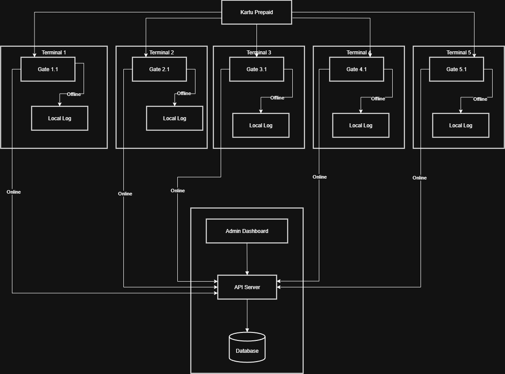
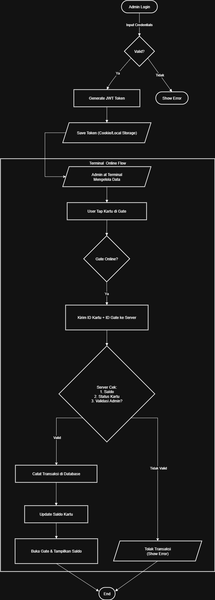
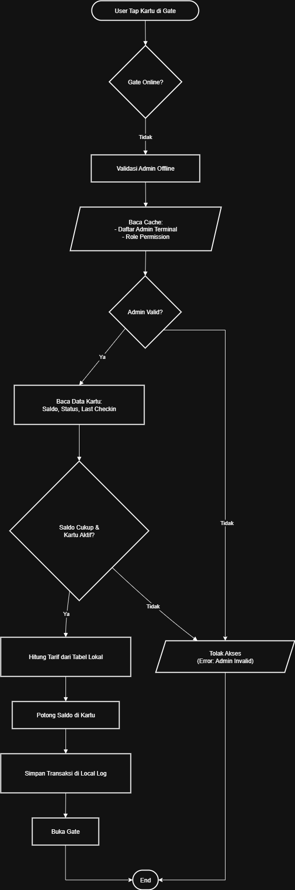
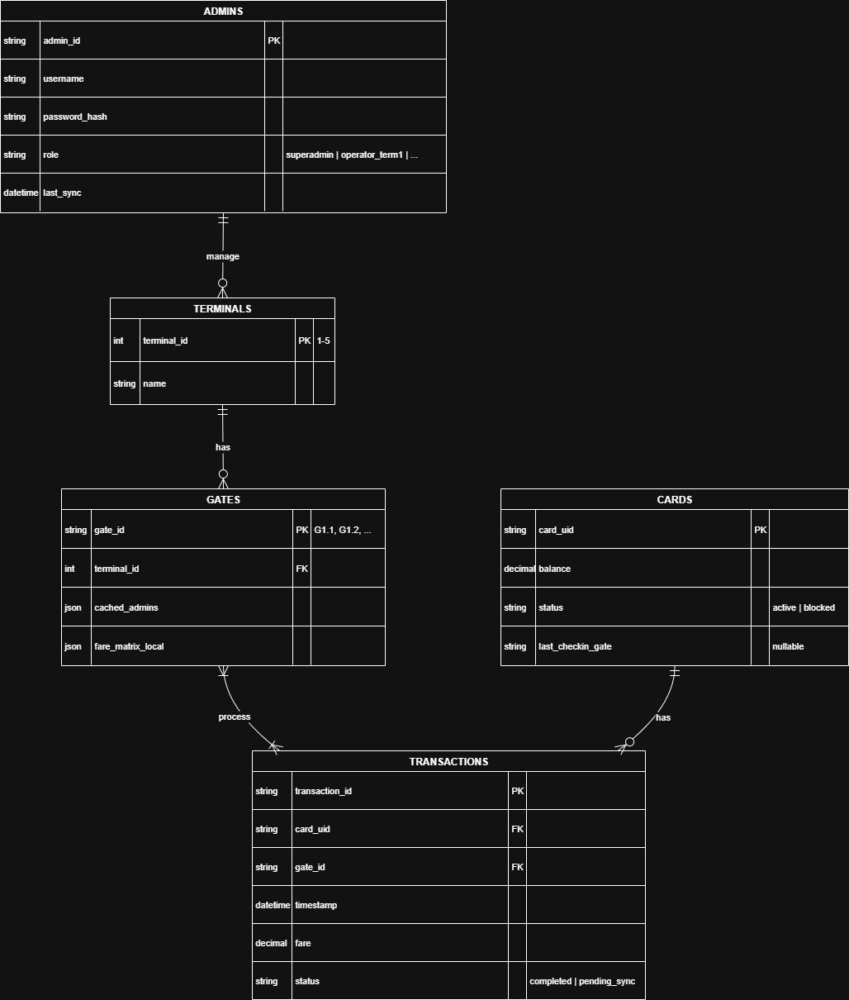

# Sistem E-Ticketing Transportasi Publik
---

## Desain Sistem dan Arsitektur

### Prinsip Desain
Arsitektur ini menganut prinsip **sistem terdistribusi** di mana setiap gate memiliki otonomi untuk membuat keputusan transaksi dasar saat offline.

### **Komponen Utama**  
**1. Kartu Prepaid**  
- Menyimpan: Saldo, ID kartu, status perjalanan terakhir  

**2. Gate Validasi**  
- Tabel tarif lokal  
- Cache data admin  
- Log transaksi offline  

**3. Server Pusat**  
- Validasi real-time  
- Manajemen data master  
- Sinkronisasi transaksi offline  

**4. Admin Dashboard**  
- Kelola terminal, tarif, dan user  
- Akses berbasis role (superadmin/operator)  

### Arsitektur Sistem
Diagram berikut mengilustrasikan hubungan antar komponen utama dalam sistem.



### Alur Proses Saat Online
Dalam kondisi normal, semua logika utama dieksekusi oleh Server Pusat secara *real-time*.



### Alur Proses Saat Offline



---

### Diagram Relasi Entitas (ERD)
Diagram ini menunjukkan tabel-tabel utama dan hubungan antar tabel.



### Penjelasan Tabel Database

**1. ADMINS**  
- **admin_id**: ID unik admin (primary key)  
- **username**: Nama pengguna  
- **password_hash**: Password terenkripsi  
- **role**: Hak akses (superadmin/operator terminal)  
- **last_sync**: Waktu terakhir sinkronisasi  

**2. TERMINALS**  
- **terminal_id**: ID terminal 1-5 (primary key)  
- **name**: Nama terminal  

**3. GATES**  
- **gate_id**: Kode gate (contoh: G1.1, G2.1)  
- **terminal_id**: ID terminal terkait  
- **cached_admins**: Daftar admin yang di-cache  
- **fare_matrix_local**: Tabel tarif lokal  

**4. CARDS**  
- **card_uid**: ID unik kartu (primary key)  
- **balance**: Saldo  
- **status**: Status kartu (active/blocked)  
- **last_checkin_gate**: Gate terakhir check-in  

**5. TRANSACTIONS**  
- **transaction_id**: ID transaksi (primary key)  
- **card_uid**: ID kartu  
- **gate_id**: Gate transaksi  
- **timestamp**: Waktu transaksi  
- **fare**: Jumlah tarif  
- **status**: Status transaksi (completed/pending_sync)  


## Prasyarat

Sebelum memulai, pastikan Anda telah menginstal perangkat lunak berikut di sistem Anda:

-   [Go](https://go.dev/doc/install) (versi 1.18 atau lebih baru)
-   [PostgreSQL](https://www.postgresql.org/download/) (versi 12 atau lebih baru)
-   [Git](https://git-scm.com/downloads)

---

## Instalasi dan Konfigurasi

Ikuti langkah-langkah berikut untuk menjalankan proyek ini di lingkungan lokal Anda.

**1. Clone Repositori**
```bash
git clone [https://github.com/NAMA_USER_ANDA/NAMA_REPO_ANDA.git](https://github.com/NAMA_USER_ANDA/NAMA_REPO_ANDA.git)
cd e-ticketing-api
```

**2. Pengaturan Database PostgreSQL**
Masuk ke psql dan buat database serta user baru.
```bash
psql -U postgres
CREATE DATABASE eticketing_db;
CREATE USER eticketing_user WITH PASSWORD 'password_anda';
GRANT ALL PRIVILEGES ON DATABASE eticketing_db TO eticketing_user;
```

**3. Impor Skema Database**
Jalankan file schema.sql untuk membuat tabel dan menyisipkan data awal.
```bash
psql -U eticketing_user -d eticketing_db -f schema.sql
```

**4. Konfigurasi Environment**
Buat file .env, kemudian, buka file .env dan sesuaikan nilainya dengan konfigurasi database Anda.
```bash
DB_HOST=localhost
DB_PORT=5432
DB_USER=username_anda
DB_PASSWORD=password_anda
DB_NAME=eticketing_db
API_SECRET=ganti_secret_ini
SERVER_PORT=:8080
```

**5. Instal Dependensi Go**
```bash
go mod tidy
```

**6. Jalankan Aplikasi**
```bash
go run main.go
```
```bash
Server Anda sekarang seharusnya berjalan di http://localhost:8080.
```

### **API Documentation**
Berikut adalah cara menggunakan endpoint API yang tersedia.

**🔑 1. Login Admin**
Endpoint ini digunakan untuk mengotentikasi pengguna dan mendapatkan token JWT.
- Method: POST
- URL: /api/v1/login
- Body (JSON):
```bash
{
    "username": "superadmin",
    "password": "password123"
}
```
- Contoh cURL:
```bash
curl -X POST http://localhost:8080/api/v1/login \
-H "Content-Type: application/json" \
-d '{
    "username": "superadmin",
    "password": "password123"
}'
```

**🚉 2. Membuat Terminal Baru**
Endpoint ini dilindungi dan hanya bisa diakses oleh superadmin dengan menyertakan token JWT.
- Method: POST
- URL: /api/v1/terminals
- Authorization: Bearer <TOKEN_JWT_ANDA>
- Body (JSON):
```bash
{
    "name": "Terminal Condongcatur"
}
```
- Contoh cURL:
```bash
# Ganti YOUR_JWT_TOKEN dengan token yang didapat dari login
curl -X POST http://localhost:8080/api/v1/terminals \
-H "Content-Type: application/json" \
-H "Authorization: Bearer YOUR_JWT_TOKEN" \
-d '{
    "name": "Terminal Condongcatur"
}'
```